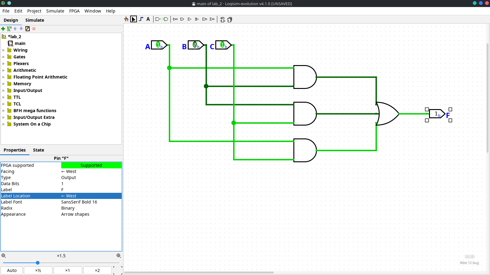
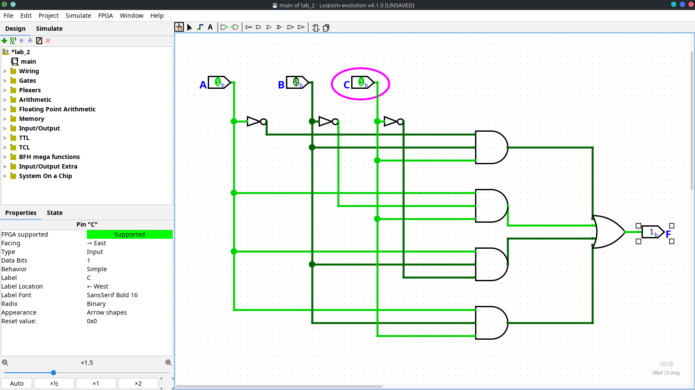
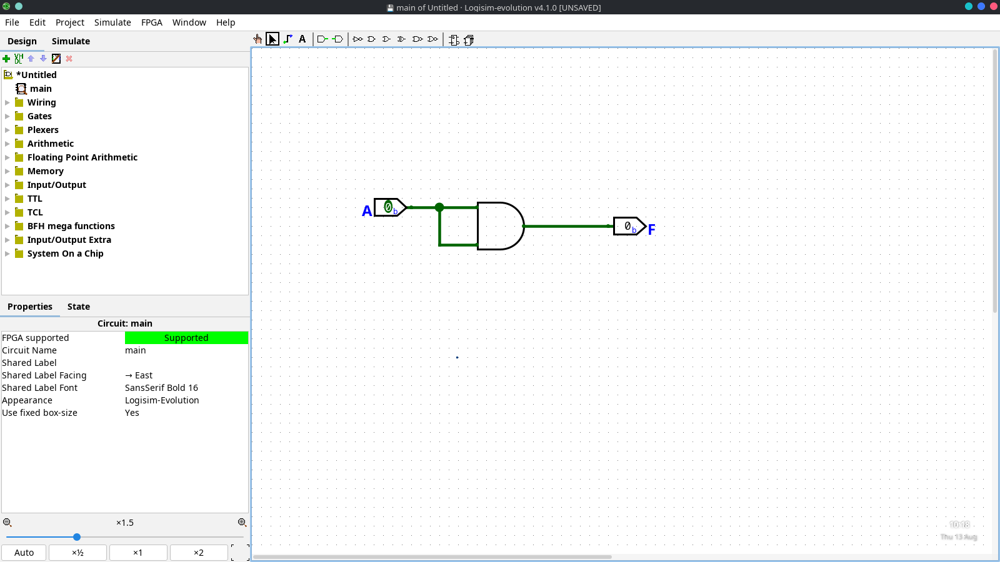
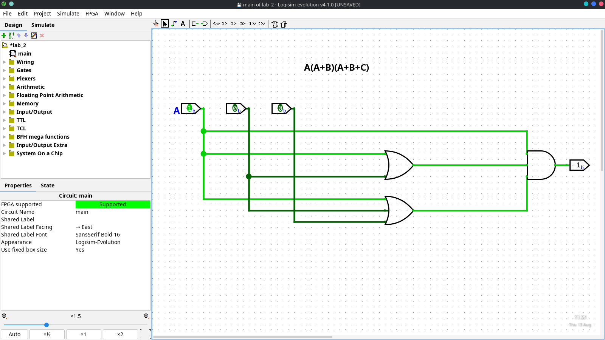
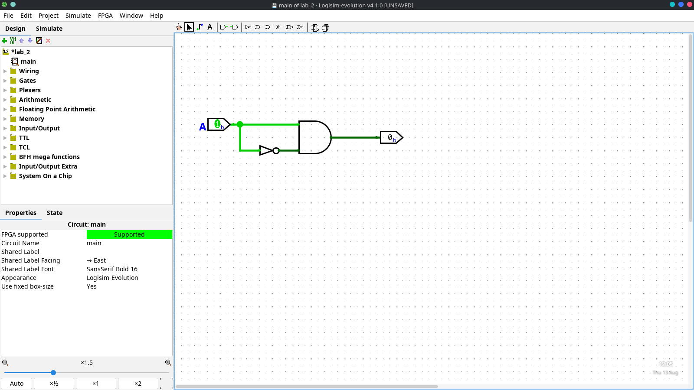
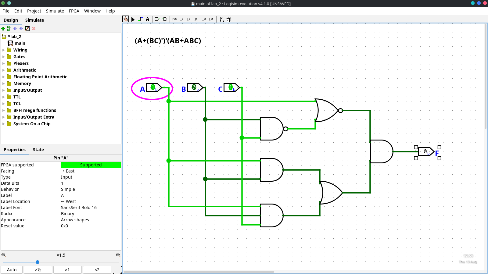
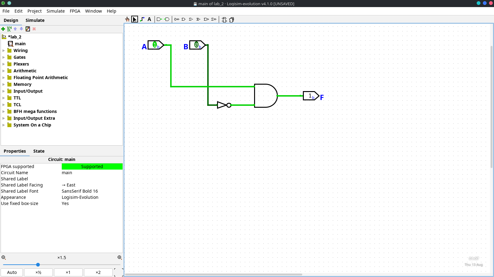
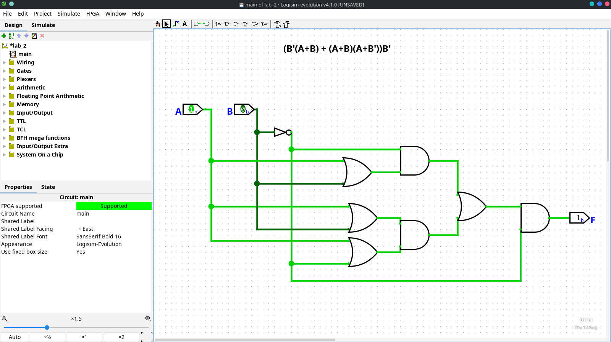

# Lab 2
## Experiment title: Simplification and Implementation of Boolean Expressions Using Boolean Algebra and Karnaugh Maps and Logisim.

### **Objective:**
- To simplify Boolean expressions using Boolean algebraic laws and theorems.
- To simplify Boolean expressions using Karnaugh maps.
- To implement the simplified Boolean expressions using Logisim.
- To verify the correctness of the simplified Boolean expressions using truth tables.
- To verify the correctness of the simplified Boolean expressions using Logisim.
- To compare the results obtained from Boolean algebra, Karnaugh maps, and Logisim.

### **Apparatus/ Software Required:**
- Computer with Logisim software installed.
- Paper and pen for manual calculations.
- Karnaugh map templates.
- Boolean algebra reference materials (laws and theorems).

### **Theory:**
Boolean algebra is a branch of mathematics that deals with variables that have two possible values: true (1) and false (0). It is used to analyze and simplify digital logic circuits. The simplification of Boolean expressions can be achieved using Boolean algebraic laws and theorems, as well as Karnaugh maps (K-maps).

Using Boolean algebra, we can apply various laws such as the commutative, associative, distributive, identity, null, complement, and De Morgan's laws to simplify expressions. Karnaugh maps provide a visual method for simplifying Boolean expressions by grouping adjacent cells representing minterms.

A K-map is a grid-like representation of truth tables that allows for the identification of common factors and simplification of expressions. Each cell in the K-map corresponds to a minterm, and adjacent cells can be combined to form simplified expressions.

After simplification, the resulting Boolean expressions can be implemented using digital logic gates in Logisim, a software tool for designing and simulating digital circuits. The correctness of the simplified expressions can be verified by constructing truth tables and comparing the outputs of the original and simplified expressions.

### **Given Boolean Expression:**

#### **Boolean Expression 1:**

$$F(A, B, C) = A'BC + AB'C + ABC' + ABC$$

**Simplifying the expression using Boolean algebra:**

$$
\begin{aligned}
F(A,B,C) &= A^{\prime}BC + AB^{\prime}C + ABC^{\prime} + ABC \\
         &= A^{\prime}BC + AB^{\prime}C + ABC^{\prime} + ABC + ABC + ABC \\
         &= BC(A^{\prime}+A) + AC(B^{\prime}+C) + AB(B^{\prime}+C) \\
         &= BC(1) + AC(1) + AB(1) \\
         &= BC + AC + AB \\
         &= AB + AC + BC
\end{aligned}
$$

**Simplifying the expression using Karnaugh maps:**

### K-Map

$$
F(A,B,C)=\Sigma m(3,5,6,7)
$$

| A \ BC | 00 | 01 | 11 | 10 |
|:------:|:--:|:--:|:--:|:--:|
| **0**  | 0  | 0  | 1  | 0  |
| **1**  | 0  | 1  | 1  | 1  |

### Grouping

- $m_3$ and $m_7$ → $BC$
- $m_5$ and $m_7$ → $AC$
- $m_6$ and $m_7$ → $AB$

Therefore,

$$
F = AB + AC + BC
$$

### **Implementation using Logisim:**

### **Verification :**

#### **Boolean Expression 2:**

$$F(A, B, C) = A(A+B)(A+B+C)$$

**Simplifying the expression using Boolean algebra:**

$$
\begin{aligned}
F(A,B,C) &= A(A+B)(A+B+C) \\
         &= (A+AB)(A+B+C) \\
         &= A(1+B)(A+B+C) \\
         &= A(A+B+C) \\
         &= AA + AB + AC \\
         &= A + AB + AC \\
         &= A(1+B+C) \\
         &= A
\end{aligned}
$$

**Simplifying the expression using Karnaugh maps:**

### K-Map

$$
F(A,B,C)=\Sigma m(0,1,2,3)
$$

| A \ BC | 00 | 01 | 11 | 10 |
|:------:|:--:|:--:|:--:|:--:|
| **0**  | 0  | 0  | 0  | 0  |
| **1**  | 1  | 1  | 1  | 1  |

### Grouping
- $m_0$ and $m_1$ → $A$
- $m_2$ and $m_3$ → $A$

Therefore,
$$
F = A
$$

### **Implementation using Logisim:**
**Using AND gate**

**Using OR gate**

### **Verification :**

### **Boolean Expression 3:**

$$F(A, B, C) = (A+(BC)')'(AB+ABC)$$

**Simplifying the expression using Boolean algebra:**

$$
\begin{aligned}
F(A,B,C) &= (A+(BC)')'(AB+ABC) \\
         &= (A+B'C')'(AB+ABC) \\
         &= A'BC(AB+ABC) \\
         &= A'BC\cdot AB(1+C) \\
         &= A'BC\cdot AB \\
         &= A'A\,BC \\
         &= 0
\end{aligned}
$$

**Simplifying the expression using Karnaugh maps:**

### K-Map

$$
F(A,B,C)=0
$$

| A \ BC | 00 | 01 | 11 | 10 |
|:------:|:--:|:--:|:--:|:--:|
| **0**  | 0  | 0  | 0  | 0  |
| **1**  | 0  | 0  | 0  | 0  |

### Grouping

There are no 1s in the K-map, so no grouping is possible.

Therefore,

$$
F = 0
$$

### **Implementation using Logisim:**

### **Verification :**

### **Boolean Expression 4:**

$$F(A, B, C) = (B'(A+B) + (A+B)(A+B'))B'$$

**Simplifying the expression using Boolean algebra:**

$$
\begin{aligned}
F(A,B,C) &= (B'(A+B) + (A+B)(A+B'))B' \\
         &= (A+B)(B' + A+B')B' \\
         &= (A+B)(A+B')B' \\
         &= A B'
\end{aligned}
$$

**Simplifying the expression using Karnaugh maps:**

### K-Map

$$
F(A,B,C)=\Sigma m(4,5)
$$

| A \ BC | 00 | 01 | 11 | 10 |
|:------:|:--:|:--:|:--:|:--:|
| **0**  | 0  | 0  | 0  | 0  |
| **1**  | 1  | 1  | 0  | 0  |

### Grouping

- $m_4$ and $m_5$ → $AB'$

Therefore,

$$
F = AB'
$$

### **Implementation using Logisim:**

### **Verification :**

### **Conclusion:**
In this lab, we successfully simplified various Boolean expressions using both Boolean algebra and Karnaugh maps. After simplification, we implemented the simplified expressions using Logisim and verified their correctness through truth tables. The results obtained from Boolean algebra, Karnaugh maps, and Logisim were consistent, confirming the accuracy of our simplifications. This exercise reinforced our understanding of Boolean algebraic laws, K-map techniques, and digital circuit implementation.
